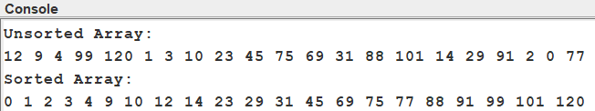
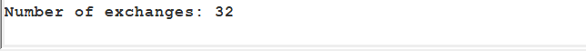

# Quicksort Sorting Algorithm Assignment

## Overview

This repository contains a Java implementation of the **Quicksort** algorithm designed to fulfill the assignment requirements:

- Implements **Quicksort** to sort an array of integers.
- The array contains **21 randomly ordered integers**.
- The program displays the sorted array to the console.
- The program tracks and reports the **number of exchanges (swaps)** made during sorting.
- Source code is compatible with the **Jeliot tool** for visualization.

---

## Source Code Description

### How the Quicksort Algorithm Works

Quicksort is a divide-and-conquer sorting algorithm that operates as follows:

1. Select a **pivot** element (in this implementation, the last element of the current subarray).
2. Partition the array so that all elements less than the pivot come before it, and all elements greater come after it.
3. Recursively apply this process to the subarrays left and right of the pivot until the entire array is sorted.

The partitioning step uses a pointer `i` to track the boundary between elements smaller than the pivot and those greater or equal. Each swap rearranges elements correctly, placing the pivot in its final sorted position.

### Exchange Counting

- The static variable `exchangeCount` keeps track of the number of swaps.
- Each time two distinct elements are swapped, the counter is incremented.
- Swaps between identical indices are not counted.

---

## Assignment Requirements Checklist

| Requirement                                     | Implemented?                        |
|------------------------------------------------|-----------------------------------|
| Uses one of: mergesort, quicksort, shellsort   | Yes (Quicksort)                   |
| Sorts array of at least 21 random integers      | Yes (21 integers provided)        |
| Displays sorted array to console                 | Yes                              |
| Calculates and reports number of exchanges       | Yes (`exchangeCount` variable)   |
| Source code executable in Jeliot                 | Yes (basic Java constructs used) |
| Provides appropriate console output              | Yes (see sample output below)    |
| Includes description of algorithm operation      | Yes (see above)                  |
| Includes asymptotic analysis (Big-O notation)    | Yes (see below)                  |

---

## Asymptotic Analysis of Quicksort

| Case       | Time Complexity | Explanation                                |
|------------|-----------------|--------------------------------------------|
| Best Case  | Ω(n log n)      | Pivot splits array into equal halves      |
| Average    | Θ(n log n)      | Balanced partitions on average             |
| Worst Case | O(n²)           | Pivot is always smallest or largest element |

- **Space Complexity**: O(log n) due to recursion stack.
- The number of exchanges depends on pivot choices; typically fewer than simpler sorts like insertion sort.

---

## Sample Console Output

```
Unsorted Array:
12 9 4 99 120 1 3 10 23 45 75 69 31 88 101 14 29 91 2 0 77 
Sorted Array:
0 1 2 3 4 9 10 12 14 23 29 31 45 69 75 77 88 91 99 101 120 
Number of exchanges: 32



```

---

## How to Use This Repository

### 1. Clone the repository

```bash
git clone https://github.com/Thimethane/quick-sort-assignment.git
cd quicksort-assignment
```


### 2. Compile the Java code

Make sure you have Java installed (JDK 8+). Then compile:

```bash
javac QuicksortWithExchanges.java
```

### 3. Run the program

```bash
java QuicksortWithExchanges
```

You should see the unsorted array, the sorted array, and the number of exchanges printed to the console.

---

## Running the Code in Jeliot

To visualize the sorting algorithm using Jeliot:

1. Download and install [Jeliot 3](https://cs.joensuu.fi/jeliot/).
2. Open Jeliot and load the `QuicksortWithExchanges.java` file.
3. Run the program inside Jeliot.
4. Observe the step-by-step execution and visualization of the quicksort algorithm.
5. The console output in Jeliot will also show the sorted array and exchange count.

---

## Additional Notes

- The code is intentionally kept simple to ensure compatibility with the Jeliot tool, which has limitations on some Java features.
- The exchange count helps understand the efficiency in terms of swaps, providing a quantitative measure of the sorting effort.
- Feel free to modify the input array for further experimentation.

---

## License

This project is provided for educational purposes under the MIT License.
